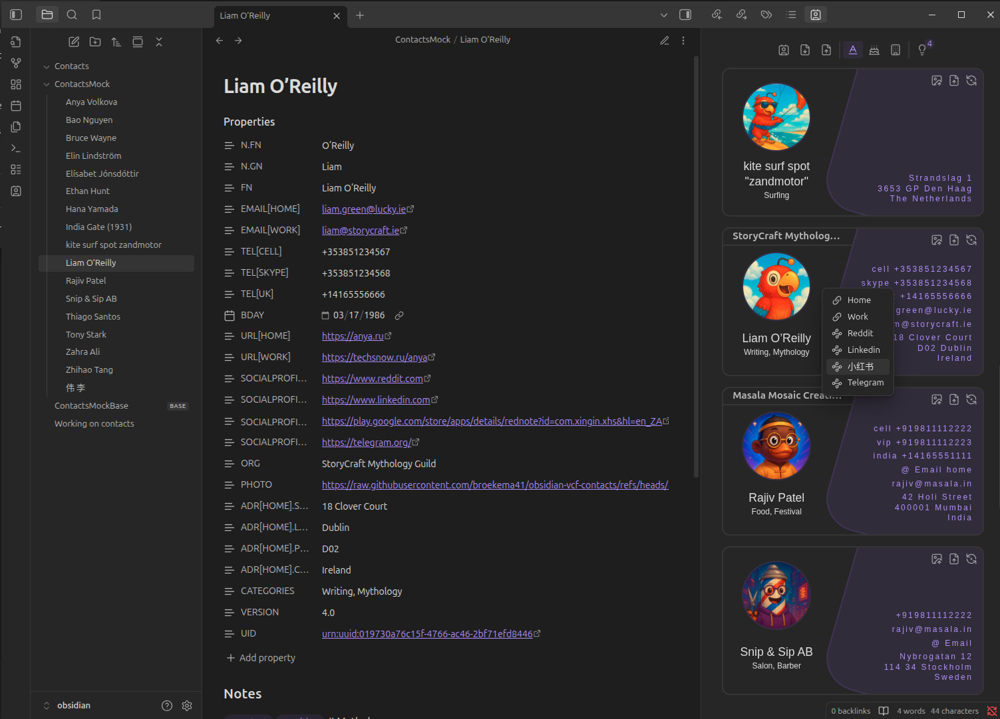
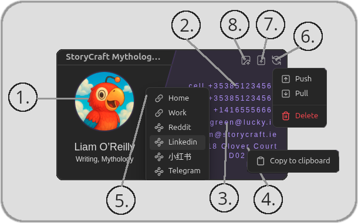
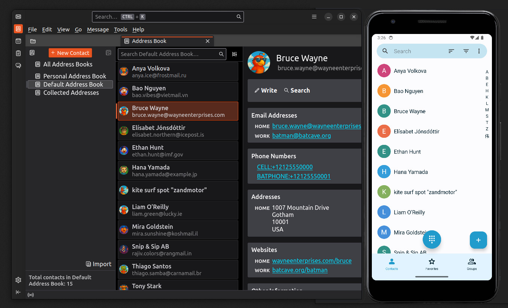

<div align="center">

<!-- TOC --><a name="-vcf-contacts-plugin-for-obsidian"></a>
# VCF Contacts Plugin for Obsidian  
**Bring people into your knowledge vault.**  


A powerful way to manage, link, and export contact data directly within [Obsidian](https://obsidian.md).



</div>

---

<!-- TOC start -->
# Table of Contents
- [VCF Contacts Plugin for Obsidian  ](#-vcf-contacts-plugin-for-obsidian)
   * [🚀 Features at a Glance](#-features-at-a-glance)
   * [📦 Installation](#-installation)
      + [🔄 Automatic via Community Plugins](#-automatic-via-community-plugins)
      + [🧰 Manual Installation](#-manual-installation)
   * [🛠️ Getting Started](#-getting-started)
      + [📁 Set Your Contacts Folder](#-set-your-contacts-folder)
      + [📥 Importing vCards (.vcf)](#-importing-vcards-vcf)
      + [📤 Exporting Contacts to vCard](#-exporting-contacts-to-vcard)
      + [🖼️ Adding Avatars](#-adding-avatars)
      + [📞 Quick Actions](#-quick-actions)
      + [➕ Create a New Contact](#-create-a-new-contact)
      + [🔎 Searching Contacts (Fast!)](#-searching-contacts-fast)
   * [📖 Understanding the vCard (VCF) Format](#-understanding-the-vcard-vcf-format)
   * [📄 Example Contact Note (Foo Bar)](#-example-contact-note-foo-bar)
   * [📌 Supported vCard Fields](#-supported-vcard-fields)
      + [📞 Basic Contact Information](#-basic-contact-information)
      + [🏠 Address Fields](#-address-fields)
      + [🌐 Online Presence](#-online-presence)
      + [🖼️ Profile Photo](#-profile-photo)
      + [🗂️ Categorization & Metadata](#-categorization-metadata)
   * [🚀 Why This Format? Why a Plugin for Obsidian?](#-why-this-format-why-a-plugin-for-obsidian)
   * [🙏 Acknowledgements](#-acknowledgements)

<!-- TOC end -->

<br>
<br>

<!-- TOC --><a name="-features-at-a-glance"></a>
## 🚀 Features at a Glance

- **Organized Contact Notes** – Every contact is a markdown file, enriched with vCard-compliant frontmatter.
- **Smart Search & Linking** – Easily find, navigate, and link to contacts from any note.
- **vCard 4.0 Support** – Import/export full contact data to/from `.vcf` files.
- **Avatars Support** – Add profile pictures from local files or URLs.
- **Birthday Reminders** – Keep track of important dates.
- **Click-to-Call & Quick Copy** – Instantly act on phone numbers, emails, and more.
- **Minimal, Markdown-native UI** – It's just markdown—but smarter.

---

<!-- TOC --><a name="-installation"></a>
## 📦 Installation

<!-- TOC --><a name="-automatic-via-community-plugins"></a>
### 🔄 Automatic via Community Plugins

1. Open **Settings → Community Plugins**
2. Disable **Safe Mode** (if enabled)
3. Click **Browse**, search for `VCF Contacts`
4. Click **Install**, then **Enable**

<!-- TOC --><a name="-manual-installation"></a>
### 🧰 Manual Installation


1. Download `main.js`, `manifest.json`, and `styles.css` from the GitHub Releases page.
2. Create the plugin folder in your vault:
   <VaultFolder>```/.obsidian/plugins/obsidian-vcf-contacts```
3. Move the downloaded files into this folder.
4. Restart Obsidian and enable the plugin from ```Settings → Community Plugins```.

---

<!-- TOC --><a name="-getting-started"></a>
## 🛠️ Getting Started

<!-- TOC --><a name="-set-your-contacts-folder"></a>
### 📁 Set Your Contacts Folder

1. Go to **Settings → Contacts**
2. Set your **Contacts Folder Location** to any existing folder in your vault
3. You’re ready to start importing or creating contact notes!

---

<!-- TOC --><a name="-importing-vcards-vcf"></a>
### 📥 Importing vCards (.vcf)

1. Open the **Contacts** sidebar tab
2. Click **Import VCF**
3. Choose a `.vcf` file (single contact or full database)
4. If needed, you'll be prompted to fill in:
   - `Given Name` (First Name)
   - `Family Name` (Last Name)

> These are required to identify and name contact files properly.

---

<!-- TOC --><a name="-exporting-contacts-to-vcard"></a>
### 📤 Exporting Contacts to vCard

1. Select a contact or open the plugin interface
2. Click **Export VCF**
3. Choose a location to save the `.vcf` file (vCard 4.0 format)

---

<!-- TOC --><a name="-adding-avatars"></a>
### 🖼️ Adding Avatars

You can attach profile pictures using:

- 🖼️ **Local File**:  
  Click **Process Avatar**, choose an image (`.jpg`, `.png`, etc.)

- 🌐 **Image URL**:  
  Paste a URL in the `PHOTO:` field and click **Process Avatar**

> The avatar will be scaled and stored inside Obsidian's vault-local storage.

---

<!-- TOC --><a name="-quick-actions"></a>
### 📞 Actions available on the card



1. **left-click** Open contact markdown note
2. **Click to Call**: Phone numbers auto-open your default dialer
3. **Click to Email**: Launches your email client
4. **Right-click** any contact property → **Copy to Clipboard**
5. **Right-click** Open Social Links
6. **left-click** contact server sync when active
7. **left-click** export as .vcf file
8. **left-click** process and import avatar from image file

---

### ⚡ Quick Actions

The plugin provides command-based quick actions that can be accessed through Obsidian’s Command Palette.

Open the Command Palette with:

- **Ctrl + P** (Windows/Linux)
- **Cmd + P** (macOS)

Search for **“VCF Contacts”** to see all available commands.

1) **VCF Contacts: Create Contact**  
Create a new contact using your configured default fields.

2) **VCF Contacts: Open Contacts Sidebar**  
Open the contacts sidebar view.

3) **VCF Contacts: Apply Default Fields to Current File**  
Adds any missing default fields (as defined in **Settings → Default Contact Fields**) to the currently open contact file.  
Existing fields are not overwritten.

---

<!-- TOC --><a name="-create-a-new-contact"></a>
### ➕ Create a New Contact

1. Click **Create Contact**
2. Fill in:
   - `Given Name`
   - `Family Name`
3. Add any extra details:
   - Phone numbers, emails, websites, etc.
4. Your contact is now saved as a markdown file and export-ready!

> Supports all vCard 4.0-compatible fields. Feel free to link, tag, or extend notes as needed!

---

<!-- TOC --><a name="-searching-contacts-fast"></a>
### 🔎 Searching Contacts (Fast!)

Use Obsidian's **Quick Switcher**:

- Press `Ctrl + O` (Windows/Linux) or `Cmd + O` (Mac)
- Type part of the contact’s name
- Select and hit **Enter** — the contact opens instantly

> The plugin will scroll to the selected contact card in the sidebar.

---

<!-- TOC --><a name="-understanding-the-vcard-vcf-format"></a>
## 📖 Understanding the vCard (VCF) Format

The **vCard format** (`.vcf`) is the international standard for storing and sharing contact details in a structured, machine-readable format.

It supports a wide range of information, including:

- 🧑‍💼 **Names and nicknames**
- 📱 **Phone numbers**
- ✉️ **Email addresses**
- 🏡 **Addresses**
- 🌐 **Websites and social links**
- 🖼️ **Profile photos**
- 🎂 **Birthdays and anniversaries**
- 🏷️ **Tags and categories**
- 🔒 **Privacy metadata and revision history**

Using this format ensures your contacts are **portable**, **interoperable**, and **future-proof**.. Whether you're syncing across devices or backing up your data.

> ✅ The VCF Contacts plugin uses **vCard 4.0**, the latest version of the specification.

📜 **Read the official vCard 4.0 spec**:  
[RFC 6350 – vCard MIME Directory Profile](https://datatracker.ietf.org/doc/html/rfc6350)


---

<!-- TOC --><a name="-example-contact-note-foo-bar"></a>
## 📄 Example Contact Note (Foo Bar)

Below is a sample contact note for **Ethan Hunt**, showcasing real-world-style fields supported by the plugin and the vCard 4.0 format:


```markdown
---
N.FN: Hunt
N.GN: Ethan
FN: Ethan Hunt
PHOTO: https://raw.githubusercontent.com/broekema41/obsidian-vcf-contacts/refs/heads/master/assets/demo-data/avatars/avatar10.jpg
"EMAIL[HOME]": ethan.hunt@imf.gov
"EMAIL[WORK]": mission.control@imf.gov
"TEL[CELL]": "+13035551234"
"TEL[SECURE]": "+13035551235"
"TEL[CANADA]": "+14165551234"
BDAY: 1964-07-03
"URL[HOME]": https://imf.gov/agents/hunt
"URL[WORK]": https://phoenix.imf.gov/ethan
ORG: Impossible Missions
"ADR[HOME].STREET": 221B Spyglass Lane
"ADR[HOME].LOCALITY": Unknown
"ADR[HOME].POSTAL": "00000"
"ADR[HOME].COUNTRY": USA
CATEGORIES: Spy, Agent, Action
UID: urn:uuid:019730a76c0df-4fa2-b0cf-8078e4717c93
VERSION: "4.0"

---
#### Notes

#Contact #Spy #Agent #Action
```

---

<!-- TOC --><a name="-supported-vcard-fields"></a>
## 📌 Supported vCard Fields

Here’s a breakdown of supported vCard fields and their **human-readable meanings** — tailored for clarity and real-world use.

<!-- TOC --><a name="-basic-contact-information"></a>
### 📞 Basic Contact Information

| **vCard Field**     | **Readable Name**              | **Example**                 |
|---------------------|-------------------------------|-----------------------------|
| `VERSION`           | vCard Version                  | `4.0`                       |
| `N.PREFIX`          | Name Prefix (e.g., Mr., Dr.)   | `Dr.`                       |
| `N.GN`              | Given Name (First Name)        | `Foo`                       |
| `N.MN`              | Middle Name                    | `Middleton`                |
| `N.FN`              | Family Name (Last Name)        | `Bar`                       |
| `N.SUFFIX`          | Name Suffix (e.g., Jr., III)   | `Jr.`                       |
| `FN`                | Full Name                      | `Foo Bar`                   |
| `NICKNAME`          | Nickname                       | `Foobar`                    |
| `EMAIL[HOME]`       | Personal Email                 | `foo.bar@example.com`       |
| `EMAIL[WORK]`       | Work Email                     | `foo.bar@corporate.fake`    |
| `TEL[CELL]`         | Mobile Phone                   | `+1234567890`               |
| `TEL[HOME]`         | Home Phone                     | `+1987654321`               |
| `TEL[WORK]`         | Work Phone                     | `+1098765432`               |
| `BDAY`              | Birthday (YYYY-MM-DD)          | `1985-12-31`                |
| `GENDER`            | Gender                         | `M`, `F`, `X`               |
| `ORG`               | Organization Name              | `FakeCorp Inc.`             |
| `TITLE`             | Job Title                      | `Senior Developer`          |
| `ROLE`              | Job Role                       | `Software Engineer`         |

---

<!-- TOC --><a name="-address-fields"></a>
### 🏠 Address Fields

| **vCard Field**         | **Readable Name**             | **Example**                  |
|-------------------------|-------------------------------|------------------------------|
| `ADR[HOME].STREET`      | Home Street Address           | `123 Fake Street`            |
| `ADR[HOME].LOCALITY`    | Home City                     | `Faketown`                   |
| `ADR[HOME].REGION`      | Home State/Province           | `FakeState`                  |
| `ADR[HOME].POSTAL`      | Home Postal Code              | `00000`                      |
| `ADR[HOME].COUNTRY`     | Home Country                  | `Nowhere Land`               |
| `ADR[WORK].STREET`      | Work Street Address           | `789 Corporate Ave`          |
| `ADR[WORK].LOCALITY`    | Work City                     | `Business City`              |
| `ADR[WORK].REGION`      | Work State/Province           | `IndustryState`              |
| `ADR[WORK].POSTAL`      | Work Postal Code              | `99999`                      |
| `ADR[WORK].COUNTRY`     | Work Country                  | `Enterprise Land`            |

---

<!-- TOC --><a name="-online-presence"></a>
### 🌐 Online Presence

| **vCard Field**              | **Readable Name**     | **Example**                            |
|------------------------------|------------------------|----------------------------------------|
| `URL[HOME]`                  | Personal Website       | `https://foobar.example.com`           |
| `URL[WORK]`                  | Work Website           | `https://company.fake/foobar`          |
| `SOCIALPROFILE[facebook]`   | Facebook Profile       | `https://facebook.com/foobar`          |
| `SOCIALPROFILE[twitter]`    | Twitter Profile        | `https://twitter.com/foobar`           |
| `SOCIALPROFILE[linkedin]`   | LinkedIn Profile       | `https://linkedin.com/in/foobar`       |

---

<!-- TOC --><a name="-profile-photo"></a>
### 🖼️ Profile Photo

Photo's avatars can also be imported from file and will be resized so that they become a integrated part of the contact markdown file by default. 

💡 Heads-up: The PHOTO field is a bit of a troublemaker when it comes to sync, tools, app interoperability. if there is a avatar loaded into obsidian we will not overwrite it with external data.

| **vCard Field**  | **Readable Name**      | **Example**                                |
|------------------|------------------------|--------------------------------------------|
| `PHOTO`          | Profile Picture URL    | `https://example.com/photos/foo-bar.jpg`   |

---

<!-- TOC --><a name="-categorization-metadata"></a>
### 🗂️ Categorization & Metadata

| **vCard Field** | **Readable Name**                            | **Example**                        |
|-----------------|----------------------------------------------|------------------------------------|
| `CATEGORIES`    | Tags / Categories                            | `Work, Friends`                    |
| `CLASS`         | Privacy Classification                       | `public`, `private`                |
| `KIND`          | individual, group, organization or location | `public`, `private`                |
| `REV`           | Last Updated Timestamp                       | `20240312T123456Z` (ISO 8601)      |
| `SOURCE`        | vCard Source Link                            | `https://example.com/foo-bar.vcf`  |
| `UID`           | Unique Contact ID                            | `foo-bar-uuid-1234`                |

---

<!-- TOC --><a name="-why-this-format-why-a-plugin-for-obsidian"></a>
## 🚀 Why This Format? Why a Plugin for Obsidian?

For many of us, using Obsidian is like brewing that perfect cup of coffee — energizing, efficient, and deeply satisfying. But let’s face it: managing contacts has always been a hassle.

This plugin solves that beautifully. ✨

✔ **vCard 4.0 keeps contacts tidy, organized, and universally shareable.**  
✔ **Easily import/export contacts between Obsidian and your favorite apps.**  
✔ **Covers nearly all real-world use cases personal, work, or hybrid.**  
✔ **Integrates contacts directly into your knowledge graph.**  
✔ **Feels native, modern, and fun to use.**

Start using the plugin today and share your experience in the [💬 GitHub Discussions](https://github.com/broekema41/obsidian-vcf-contacts/discussions)!

---

## 🌍 Access up to date Contacts on Devices (IOS, Android) and apps. 

This feature is for the slightly tech-savvy... or you are lucky enough to have a privacy conscious tech friend nearby!
We assume you have a CardDAV server running, know how to spin one up, or use a hosted service that does the job for you.

A typical setup looks like this:
```markdown
Obsidian VCF Contacts Plugin
        ↓
Contacts DAV Server
        ↓
 ├── DAVx⁵ → Android Contacts (read only) 
 ├── iOS Contacts (read only)
 └── Thunderbird (or any CardDAV-capable email client) (read only) 
```



#### CardDAV Server Options

You can self-host or use cardav provider. There are many, some popular options:

* **Baïkal** lightweight and easy docker container to run
* **Radicale** minimal, Python-based
* **Nextcloud Contacts** a popular alternative cloud service
* **SOGo** open-source groupware server

#### Synchronization Settings

In the plugin setting page select "sync method" CardDav. Here you can fill in the Address Book URL and credentials. pressing "Enable" button will test the connection and enable the sync when ok 

* Basic authentication (username + password)
* API key authentication

OpenID Connect (OAuth2) is not supported at this time.

---

## 🔧 Development

For plugin development:
```bash
# Install dependencies
npm install

# Build the plugin
npm run build

# Development build
npm run dev
npm run dev watch   # with auto-rebuild on changes
```

---

## 📘 Testing strategy
Our goal is to maintain high-confidence, non-UI testing that focuses on:
* Validating all resolved production bugs.
* Thoroughly testing deep module interfaces (e.g., parsing, formatting, file logic, syncing, processors etc)

Use the following commands to run tests and view coverage:
```bash
npm run test
npm run test:coverage
```

For a breakdown of our testing approach, structure, and goals, see:
👉 [our testing strategy](assets/docs/testing-strategy.md)


---

## 🌟 Support & Get Involved

We rely on our community to keep this project free and moving forward. If you believe in what we’re building, now’s the perfect time to step out of the shadows and help shape the future of this plugin!

Spread the word, connect us with sponsors, or simply share your enthusiasm, your support matters.

Ready to make a difference? [Sign up here.](https://tally.so/r/mR6rKj)

---

<!-- TOC --><a name="-acknowledgements"></a>
## 🙏 Acknowledgements

This plugin started as a fork of **Vadim Beskrovnov’s Contacts plugin**. While the codebase has since evolved significantly, his original work laid the foundation. Immense thanks to Vadim for the early inspiration and groundwork.


---
